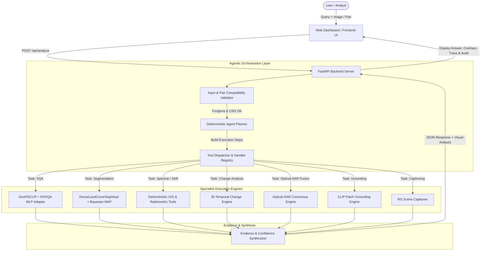

# SatQuery AI

**SatQuery AI** is an agentic, query-driven vision-language platform engineered for multimodal Earth Observation (EO) and remote-sensing image understanding. It dynamically synthesizes multi-step execution plans to orchestrate a domain-adapted vision-language backbone (`GeoRSCLIP` + trained `RSVQA` MLP adapter + `DenseLandCoverSegHead`) alongside modular geospatial spectral and radar processing engines.

---

## Overview

Remote-sensing imagery—spanning multispectral optical bands and Synthetic Aperture Radar (SAR)—provides invaluable observations of Earth's surface. However, extracting actionable intelligence traditionally requires deep GIS expertise, manual band arithmetic (NDWI, NDVI, NDBI), radar speckle filtering, radiometric calibration, and specialized desktop software. Non-specialist decision makers (e.g., disaster response coordinators, urban planners, environmental monitors) often face steep technical barriers.

**SatQuery AI** addresses this challenge by providing a unified, conversational natural-language interface for satellite imagery. Users can upload raw GeoTIFF or standard images, or select from curated real-world presets, and ask complex spatial, spectral, or temporal questions in plain English. The platform automatically determines user intent, validates CRS and footprint compatibility, selects and executes specialist tools, calibrates confidence scores, and delivers an auditable textual response supported by interactive visual overlays, spatial bounding boxes, WGS84 geographic centroids, and downloadable JSON audit reports.

---

## Smart India Hackathon 2026

- **Problem Statement**: SIH26167 (SatQuery AI)
- **Domain**: Space Technology
- **Category**: Software
- **Team**: AstraNex

---

## Key Capabilities

### Implemented
- **Single-Image Remote-Sensing VQA**: Answers natural-language questions regarding land-cover presence, scene characteristics, and urban vs. rural classification using `GeoRSCLIP` ViT-B/32 paired with a trained 50-class `RSVQA` MLP adapter.
- **Dense Multi-Class Semantic Segmentation**: Neural-spectral segmentation via `DenseLandCoverSegHead` (lightweight Convolutional Encoder-Decoder) fused with Bayesian Maximum A Posteriori (MAP) spectral log-priors, classifying pixels into **Water** (Blue), **Vegetation** (Green), **Built-up** (Red), and **Bare / Desert / Sand** (Golden Sand), alongside Shannon entropy uncertainty maps.
- **Deterministic Radiometric & Spectral Indices**: Automated calculation of physical remote-sensing indices:
  - **NDWI** (Normalized Difference Water Index) for surface water delineation.
  - **NDVI** (Normalized Difference Vegetation Index) for biomass and canopy health.
  - **NDBI** (Normalized Difference Built-up Index) and structural gradient analysis for urban footprint detection.
- **Synthetic Aperture Radar (SAR) Processing**:
  - Linear digital number (DN) to calibrated backscatter in decibels ($\text{dB} = 10 \cdot \log_{10}(\text{intensity})$).
  - Spatial Lee speckle filtering to suppress multiplicative granular noise.
  - Dielectric thresholding for specular low-backscatter water bodies ($< -15\text{ dB}$) and double-bounce urban structures ($> -6\text{ dB}$).
- **Bi-Temporal Change Analysis (T1 vs. T2)**:
  - Footprint and CRS validation between two acquisition dates.
  - Automatic chronological acquisition ordering ($T_1 < T_2$).
  - Quantitative $\Delta\%$ land-cover change and delta hectare computations.
  - Directional change classification (*increased*, *decreased*, *remained unchanged*).
  - Dual-color difference overlays (green indicating vegetation/water recovery; red/magenta indicating destruction, burn scar, or loss).
- **Cross-Modal Optical + SAR Joint Analysis**: Co-registered multi-sensor consensus analysis combining optical multispectral reflectance with radar dielectric properties, computing cross-sensor agreement scores.
- **Open-Vocabulary Visual Grounding**: Text-guided spatial localization of geographic entities into bounding boxes, spatial centroids, and pixel heatmaps.
- **Remote-Sensing Scene Captioning**: Multi-attribute land-cover summarization broken down by cardinal spatial sectors (North, South, East, West, Center).
- **Sub-Pixel Co-Registration Precision**: Cross-modal alignment bridging optical reflectance and SAR backscatter via Sobel structural gradients, Fourier phase correlation with Hanning windowing, and ECC affine refinement.
- **Deterministic Agent Planner**: Rule-based intent understanding engine (`agent/planner.py`) mapping user queries into structured tool execution sequences.
- **Interactive Web Interface**: Self-contained web dashboard (`frontend/index.html`) featuring 1-click curated demo presets, image preview toggles, side-by-side comparison, step-by-step observable execution trace, and downloadable JSON audit reports.
- **Cryptographic Benchmark Provenance**: SHA-256 validation guard checking image uploads against precomputed benchmark content hashes to enforce authentic benchmark evaluation.

### Partially Implemented / Experimental
- **Autonomous LLM-Based Re-Planning**: The platform includes tool schemas registered in `models/registry.py` and prototype router logic in `agent/router.py`. Currently, production planning runs deterministically via regex-based intent classification in `agent/planner.py`; autonomous multi-hop dynamic replanning upon execution failure is experimental.
- **Hyperspectral Band Support**: Processing is currently tuned for 3-band RGB, 4-band Sentinel-2 (RGB + NIR), and single-band SAR/grayscale rasters. Full hyperspectral cube processing (>10 bands) is experimental.

### Planned / Future Work
- Integration of larger generative vision-language Foundation Models (e.g., EarthGPT, RemoteCLIP, Qwen2-VL fine-tuned on remote sensing).
- Continuous multi-temporal time-series analysis across $N > 2$ timestamps.
- Live STAC API integration for on-demand imagery fetching from ESA Copernicus and NASA Earthdata catalogs.
- Multi-turn conversational session memory with context-aware follow-up queries.

---

## System Architecture



---

## How It Works

1. **Ingestion & Validation**:
   - The user selects a curated demo preset or uploads GeoTIFF / PNG / JPEG imagery.
   - For single images, bands are normalized using 2%–98% percentile stretching, and CRS/geotransform metadata is extracted via `rasterio` and `pyproj`.
   - For image pairs, `validate_pair_compatibility()` checks bounding box spatial intersection, CRS projection alignment, and acquisition timestamps (automatically ordering $T_1 < T_2$ for temporal change queries).
2. **Intent Understanding & Planning**:
   - `agent/planner.py:understand_query()` scans the natural-language query to classify task intent: scene captioning, bi-temporal change analysis, cross-modal optical-SAR fusion, multi-class segmentation, spatial grounding, or visual question answering (VQA).
   - `build_plan()` generates an ordered sequence of specialist steps (e.g., `input_validator` $\rightarrow$ `change_engine` $\rightarrow$ `geospatial_tools` $\rightarrow$ `result_integrator`).
3. **Specialist Tool Execution**:
   - The backend executes each step via registered handlers in `models/registry.py`.
   - Spectral indices (NDWI, NDVI, NDBI) and calibrated SAR backscatter masks are generated.
   - For segmentation, neural logits from `DenseLandCoverSegHead` are blended with spectral log-priors using Bayesian MAP estimation.
   - For VQA, GeoRSCLIP visual and text embeddings are passed through the trained `RSVQAAdapter` to yield top-k predictions with calibrated confidence.
4. **Evidence & Audit Synthesis**:
   - Generates visual evidence overlays (PNG preview, difference masks, bounding box annotations).
   - Computes WGS84 geographic centroids (`latitude`, `longitude`) and affected area in hectares.
   - Compiles an observable step-by-step execution trace and produces a downloadable JSON audit report.

---

## Remote-Sensing Analysis

| Modality / Analysis Type | Capabilities Supported | Implementation Module |
| :--- | :--- | :--- |
| **Optical / Multispectral** | 2%–98% robust percentile contrast stretching, RGB extraction, NIR band detection, NDWI surface water extraction, NDVI vegetation masking, NDBI built-up indexing. | `geospatial/water_detector.py`, `geospatial/vegetation_detector.py`, `geospatial/builtup_detector.py` |
| **Synthetic Aperture Radar (SAR)** | Linear DN to decibel ($\text{dB}$) backscatter calibration, $5\times 5$ spatial Lee speckle filtering, specular low-backscatter water detection ($< -15\text{ dB}$), double-bounce urban backscatter detection ($> -6\text{ dB}$). | `geospatial/sar_processor.py` |
| **Multi-Temporal Change** | Footprint overlap verification, chronological sorting, pixel-level radiometric difference, Otsu/adaptive thresholding, directional change reasoning (increase/decrease/unchanged), $\Delta\%$ and hectare area shifts, dual-color overlays. | `geospatial/change_detector.py` |
| **Optical + SAR Fusion** | Co-registered cross-modal consensus analysis, Fourier phase correlation and ECC affine refinement, multi-sensor agreement scoring. | `geospatial/fusion.py`, `geospatial/coregistration.py` |
| **Visual Question Answering (VQA)** | Land-cover presence verification, urban vs. rural classification, counting queries, top-5 prediction ranking, entropy-calibrated confidence scores. | `models/rs_vlm.py`, `models/checkpoints/satquery_rs_model/` |
| **Semantic Segmentation** | 4-class dense classification (Water, Vegetation, Built-up, Bare/Sand) combining CNN encoder-decoder with physical spectral log-priors. | `models/land_cover_head.py`, `geospatial/multi_class_segmenter.py` |
| **Visual Grounding** | Patch-based open-vocabulary localization, bounding box coordinates, WGS84 centroid computation, contour extraction. | `geospatial/clip_grounding.py` |
| **Scene Captioning** | Multi-attribute natural-language scene summary with 5 cardinal sector spatial breakdowns (North, South, East, West, Center). | `geospatial/scene_captioner.py` |

---

## Models and AI Components

| Model Component | Architecture / Backbone | Framework | Implementation / Weights | Training & Adaptation Status |
| :--- | :--- | :--- | :--- | :--- |
| **RS-VLM Backbone** | GeoRSCLIP ViT-B/32 (`BiliSakura/GeoRSCLIP-ViT-B-32`) | PyTorch, `open-clip-torch` | `models/rs_vlm.py` | Pretrained remote-sensing vision-language foundation model loaded via OpenCLIP. |
| **RSVQA Adapter** | 2-Layer MLP Classifier (`input_dim=1024`, `hidden_dim=512`, `num_classes=50`) | PyTorch | `models/rs_vlm.py`, `models/checkpoints/satquery_rs_model/adapter.pt` | Trained on RSVQA-LR-2k dataset with Cross-Entropy Loss, mapping concatenated image-text embeddings to 50 remote-sensing answer classes. |
| **DenseLandCoverSegHead** | Lightweight Convolutional Encoder-Decoder with residual bottleneck | PyTorch | `models/land_cover_head.py` | Initialized with physically calibrated spectral filters; ensembled with physical index priors (NDWI, NDVI, NDBI) via Bayesian MAP inference. |
| **Deterministic GIS Engines** | Physics-based spectral arithmetic, Fourier phase correlation, affine transformation | NumPy, OpenCV, Rasterio, Pyproj, Shapely | `geospatial/` | Deterministic mathematical algorithms operating on raster pixel arrays and CRS projection matrices. |

---

## Datasets and Benchmarks

### Actually Used in Repository
- **BigEarthNet-MM (Sentinel-2 + Sentinel-1)**: Authentic co-registered multispectral patch (`S2_multispectral_patch.tif`) and SAR patch (`S1_sar_patch.tif`) in `demo_data/bigearthnet/` alongside full evaluation records (`bigearthnet_full_test.json`, `bigearthnet_full_train.json`) in `data/external_datasets/bigearthnet/`. Dedicated API endpoints (`/api/bigearthnet/*`) support record pagination and automated sample evaluation.
- **RSVQA (Remote Sensing Visual Question Answering - Low Resolution)**: 200 evaluation samples and ground-truth manifests (`rsvqa_official_eval.json`, `rsvqa_full_test.json`, `rsvqa_train.json`) and 200 authentic images in `data/external_datasets/rsvqa/` used for adapter training and validation.
- **VRSBench**: Benchmark covering captioning, visual grounding, and VQA. Evaluation manifests (`VRSBench_EVAL_Cap.json`, `VRSBench_EVAL_referring.json`, `VRSBench_EVAL_vqa.json`) and 26 evaluation images in `data/external_datasets/vrsbench/` and `demo_data/vrsbench/`.
- **CDVQA (Change Detection Visual Question Answering)**: Bi-temporal change detection questions and answers (`Test_questions.json`, `Test_answers.json`, `cdvqa_official_eval.json`) with sample pairs in `demo_data/cdvqa/`.
- **ISRO SAC Cartosat-2S & RISAT-1A**: Co-registered sub-meter optical and C-band SAR validation pair in `demo_data/isro_sac/`.
- **Real-World Satellite Cloud-Optimized GeoTIFFs (COGs)**: San Francisco Bay COG optical and SAR, Sentinel-1 Alps SAR, and USGS elevation data in `demo_data/real_world_satellite/`.
- **7 Curated Global Edge-Case Rasters**: Simulated remote-sensing scenarios in `demo_data/edge_cases/` representing dense urban (Paris), tropical rainforest (Amazon), coastal water (Mediterranean), arid desert (Sahara), agricultural farmland (Ukraine), river delta (Nile), and mixed suburban (London outskirts).

### Referenced for Research / Evaluation
- **BigEarthNet.txt** (*arXiv:2603.29630*): Used as the reference protocol for multimodal remote-sensing evaluation.
- **ESA Copernicus Open Access Hub**: Reference for Sentinel-1 GRD and Sentinel-2 L2A product formats.

### Planned
- **EuroSAT**: Planned for extended multi-spectral land use classification benchmarking.
- **LEVIR-CD+**: Planned for high-resolution optical building change detection evaluation.

---

## Features

| Feature | Description |
| :--- | :--- |
| **1-Click Demo Presets** | Instant evaluation presets for BigEarthNet-MM, San Francisco Bay, Kolkata Urban Corridor, ISRO Cartosat+RISAT, California Wildfire Change, and 7 Global Edge Cases without uploading external files. |
| **Multi-Format Ingestion** | Supports GeoTIFF (`.tif`, `.tiff`), PNG, and JPEG formats up to 200 MB. |
| **Dual Image Slots** | Side-by-side file ingestion supporting bi-temporal comparison ($T_1$ vs. $T_2$) or cross-modal optical + SAR analysis. |
| **Observable Execution Trace** | Step-by-step observable log detailing CRS validation, intent routing, tool execution times, and synthesis steps. |
| **Visual Evidence Overlays** | Interactive map/image viewer with opacity slider, mask toggles, and side-by-side comparison mode. |
| **Spatial Grounding & Coordinates** | Interactive bounding boxes, area calculation in hectares, and WGS84 geographic centroids (`lat`, `lon`). |
| **Audit Report Export** | Complete downloadable JSON audit report containing provenance hashes, metadata, tool outputs, and confidence metrics. |
| **BigEarthNet Benchmark Viewer** | Paginated browser for BigEarthNet.txt benchmark questions, CORINE land-cover classes, and real-time model evaluation. |
| **CLI Management Utility (`satqueryctl`)** | Command-line script to start, stop, restart, check status, and configure notification alerts. |

---

## Technology Stack

| Component | Technologies Used |
| :--- | :--- |
| **Programming Language** | Python 3.11+ |
| **Web Framework & API** | FastAPI 0.110+, Uvicorn 0.29+, Pydantic v2, Python-Multipart |
| **Deep Learning & Vision** | PyTorch 2.2+, Torchvision 0.17+, `open-clip-torch` 2.24+, `huggingface-hub` 0.20+ |
| **Geospatial & Raster** | Rasterio 1.3.9+, GDAL C-libraries (`libgdal`), Pyproj 3.6.1+, Shapely 2.0.3+, Affine 2.4.0+ |
| **Image Processing** | OpenCV (`opencv-python-headless` 4.9+), Pillow 10.0+, NumPy 1.26+ |
| **Frontend** | Vanilla HTML5, CSS3 (Glassmorphism design system), Vanilla JavaScript (ES6+), FontAwesome Icons, Inter Font |
| **Deployment & Services** | Docker, Render (`render.yaml`), systemd (`satquery.service`), Bash CLI (`satqueryctl`) |

---

## Project Structure

```
satquery-ai/
├── agent/                          # Agentic planning and intent routing
│   ├── __init__.py
│   ├── planner.py                  # Deterministic intent parser and multi-step execution planner
│   └── router.py                   # Prototype routing definitions
├── app.py                          # Application entry point (Uvicorn runner)
├── backend/                        # FastAPI application core
│   ├── __init__.py
│   └── app.py                      # Main backend API routes, image readers, and synthesis
├── benchmarks/                     # Benchmark evaluation suites
│   ├── evaluate_benchmarks.py      # Automated benchmark runner (RSVQA, VRSBench, CDVQA, BigEarthNet)
│   └── evaluate_metrics.py         # Evaluation metrics (BLEU, ROUGE-L, VQA accuracy, IoU)
├── data/                           # Evaluation manifests and benchmark datasets
│   └── external_datasets/          # Ground truth JSONs and sample images (RSVQA, VRSBench, CDVQA, BigEarthNet)
├── demo_data/                      # Curated satellite imagery presets
│   ├── 01_kolkata_optical_georef.tif
│   ├── 02_kolkata_sar_sentinel1.tif
│   ├── 03_sentinel2_multispectral_t1.tif
│   ├── 04_sentinel2_multispectral_t2.tif
│   ├── 05_kolkata_optical.jpg
│   ├── assam_flood/                # Flood disaster bi-temporal GeoTIFF pair
│   ├── bigearthnet/                # Co-registered Sentinel-2 MSI + Sentinel-1 SAR patch
│   ├── cdvqa/                      # Wildfire burn scar bi-temporal pair
│   ├── edge_cases/                 # 7 global edge case scenario rasters
│   ├── isro_sac/                   # Cartosat optical + RISAT SAR pair
│   ├── real_world_satellite/       # San Francisco Bay COGs, Sentinel-1 Alps, USGS elevation
│   └── vrsbench/                   # High-resolution urban corridor GeoTIFFs
├── docs/                           # Project documentation assets
├── Dockerfile                      # Production Docker container configuration
├── download_sar.py                 # SAR acquisition helper utility
├── frontend/                       # Web dashboard application
│   ├── index.html                  # Main interactive dashboard (HTML5 / CSS / JavaScript)
│   └── legacy_dashboard.html       # Legacy dashboard prototype
├── generated/                      # Ephemeral output directory for masks, previews, and overlays
├── georeference_optical.py         # Georeferencing helper utility
├── geospatial/                     # Remote-sensing processing engines
│   ├── __init__.py
│   ├── builtup_detector.py         # NDBI and structural edge urban detection
│   ├── change_detector.py          # Bi-temporal change computation and overlay generation
│   ├── clip_grounding.py           # Open-vocabulary text-guided spatial grounding
│   ├── clip_segmenter.py           # Feature activation and segmentation mapping
│   ├── coregistration.py           # Sub-pixel Fourier phase correlation and ECC alignment
│   ├── fusion.py                   # Optical-SAR consensus fusion and agreement scoring
│   ├── multi_class_segmenter.py    # Multi-class land-cover semantic segmentation
│   ├── sar_processor.py            # SAR dB calibration, Lee filter, and radar thresholds
│   ├── scene_captioner.py          # Multi-attribute captioning with cardinal sectors
│   ├── vegetation_detector.py      # NDVI vegetation masking
│   └── water_detector.py           # NDWI and water body detection
├── logs/                           # Runtime log directory
├── models/                         # Neural network components and registry
│   ├── __init__.py
│   ├── checkpoints/
│   │   └── satquery_rs_model/      # Trained RSVQA adapter weights and vocab
│   │       ├── adapter.pt          # PyTorch checkpoint (2.2 MB)
│   │       ├── answer_vocab.json   # 50-class answer vocabulary
│   │       └── config.json         # Architecture hyperparameter configuration
│   ├── dataset_fetcher.py          # Automated benchmark dataset downloader
│   ├── download_real_satellite_imagery.py
│   ├── land_cover_head.py          # DenseLandCoverSegHead CNN architecture
│   ├── registry.py                 # Tool metadata schemas and dynamic handler dispatch
│   ├── rs_vlm.py                   # GeoRSCLIP backbone and RSVQA adapter loader
│   └── train_adapter.py            # PyTorch training loop for RSVQA adapter
├── render.yaml                     # Render cloud deployment specification
├── requirements.txt                # Python package dependencies
├── satqueryctl                     # Bash CLI for service management
├── scratch/                        # Diagnostic and verification test scripts
├── scripts/                        # Automation shell scripts (start, stop, tunnel, notify)
├── systemd/                        # Linux systemd service unit files
├── tests/                          # Automated verification and unit test suite (29 test modules)
└── uploads/                        # Runtime directory for temporary user uploads
```

---

## Installation

### 1. Prerequisites
- **Python**: Version 3.11 or 3.12
- **System Libraries** (Linux / macOS): Required for OpenCV and GDAL/Rasterio:
  ```bash
  sudo apt-get update && sudo apt-get install -y libgl1 libglib2.0-0 libgomp1
  ```
- **Git**

### 2. Clone the Repository
```bash
git clone https://github.com/Sathwik797/SatQuery-AI.git
cd SatQuery-AI
```

### 3. Create and Activate a Virtual Environment
- **Linux / macOS**:
  ```bash
  python3 -m venv .venv
  source .venv/bin/activate
  ```
- **Windows (PowerShell)**:
  ```powershell
  python -m venv .venv
  .venv\Scripts\Activate.ps1
  ```

### 4. Install Dependencies
```bash
pip install --upgrade pip
pip install -r requirements.txt
```

### 5. Configure Environment Variables
Copy the example environment template:
```bash
cp .env.example .env
```
*(Optionally adjust `PORT` or tunnel tokens inside `.env`).*

### 6. Start the Backend Server
```bash
python app.py
```
The server will start listening on `http://localhost:8000`.

### 7. Access the Application
Open your web browser and navigate to:
```
http://localhost:8000
```

---

## Running with Docker

You can build and run SatQuery AI inside an isolated container:

```bash
# 1. Build the Docker image
docker build -t satquery-ai .

# 2. Run the container
docker run -d -p 8000:8000 --name satquery-app satquery-ai

# 3. Access the dashboard
# Open http://localhost:8000 in your browser
```

---

## Environment Variables

| Variable Name | Description | Default Value | Required? |
| :--- | :--- | :--- | :--- |
| `PORT` | Listening TCP port for the FastAPI/Uvicorn server. | `8000` | Optional |
| `HOST` | Bind IP address for the server. | `0.0.0.0` | Optional |
| `SATQUERY_RS_MODEL_DIR` | Custom filesystem path for the trained RS model checkpoint directory. | `models/checkpoints/satquery_rs_model` | Optional |
| `CLOUDFLARE_TUNNEL_TOKEN`| Cloudflare Zero Trust tunnel token for permanent public HTTPS domain routing. | *(None)* | Optional |
| `NGROK_AUTHTOKEN` | Ngrok authorization token for tunnel fallback. | *(None)* | Optional |
| `NGROK_DOMAIN` | Custom reserved Ngrok domain. | *(None)* | Optional |
| `DISCORD_WEBHOOK_URL` | Discord webhook URL for automated deployment and server status alerts. | *(None)* | Optional |
| `TELEGRAM_BOT_TOKEN` | Telegram bot token for real-time operational notifications. | *(None)* | Optional |
| `TELEGRAM_CHAT_ID` | Telegram chat ID for alert dispatch. | *(None)* | Optional |

---

## API Documentation

### Interactive API Docs
When the server is running, interactive OpenAPI/Swagger documentation is available at:
`http://localhost:8000/docs`

### Primary Endpoints

#### 1. System Health Check
- **Method / Path**: `GET /api/health`
- **Purpose**: Verify backend status, active version, planner status, and RS-VLM availability.
- **Response**:
  ```json
  {
    "ok": true,
    "name": "SatQuery AI MVP",
    "version": "0.7.0",
    "agent_planner": "enabled",
    "rs_vlm_available": true,
    "rs_vlm_model": "GeoRSCLIP + RSVQA Adapter"
  }
  ```

#### 2. Registered Specialist Tools
- **Method / Path**: `GET /api/tools`
- **Purpose**: List all registered remote-sensing tools, schemas, capabilities, and parameters.
- **Response**:
  ```json
  {
    "tools": {
      "rs_vqa": { ... },
      "land_cover_segmenter": { ... },
      "change_engine": { ... },
      "optical_sar_fusion": { ... }
    },
    "count": 8
  }
  ```

#### 3. Image Upload
- **Method / Path**: `POST /api/upload`
- **Content-Type**: `multipart/form-data`
- **Body**: `file` (`.tif`, `.tiff`, `.png`, `.jpg`, `.jpeg`)
- **Response**:
  ```json
  {
    "id": "upload_a1b2c3d4",
    "filename": "sentinel2_scene.tif",
    "preview_url": "/generated/upload_a1b2c3d4_preview.png",
    "metadata": {
      "width": 1024,
      "height": 1024,
      "bands": 4,
      "crs": "EPSG:32633",
      "resolution": [10.0, 10.0]
    }
  }
  ```

#### 4. Load Demo Preset
- **Method / Path**: `POST /api/load_demo`
- **Content-Type**: `application/json`
- **Body**:
  ```json
  { "sample_key": "bigearthnet" }
  ```
- **Supported Keys**: `bigearthnet`, `sentinel2`, `kolkata`, `optical_sar`, `bitemporal`, `real_sf`, `real_sentinel`, and 7 edge cases: `ec_urban`, `ec_forest`, `ec_water`, `ec_desert`, `ec_agri`, `ec_delta`, `ec_suburban`.

#### 5. Execute Analysis Query
- **Method / Path**: `POST /api/analyze`
- **Content-Type**: `application/json`
- **Body**:
  ```json
  {
    "primary_id": "demo_prim_01",
    "secondary_id": "demo_sec_01",
    "query": "What changed between these two images?",
    "conversation_id": "optional-session-id"
  }
  ```
- **Response**:
  ```json
  {
    "task": "change_analysis",
    "query": "What changed between these two images?",
    "answer": "Significant vegetation loss detected: 28.4% of the area was altered (approx. 342.1 hectares affected).",
    "confidence": 0.92,
    "tool": "change_engine",
    "visual_evidence": {
      "overlay_url": "/generated/change_overlay_123.png",
      "direction": "decrease",
      "delta_percentage": -28.4,
      "delta_hectares": 342.1
    },
    "spatial_evidence": {
      "wgs84_centroid": { "lat": 39.8124, "lon": -121.4371 },
      "bounding_box": [120, 150, 890, 910]
    },
    "trace": [
      { "step": 1, "tool": "input_validator", "status": "passed" },
      { "step": 2, "tool": "change_engine", "status": "executed" },
      { "step": 3, "tool": "result_integrator", "status": "completed" }
    ]
  }
  ```

#### 6. BigEarthNet Benchmark Records
- **Method / Path**: `GET /api/bigearthnet/records?limit=10&offset=0&category=pastures`
- **Purpose**: Paginate and filter authentic BigEarthNet benchmark records.

#### 7. BigEarthNet Sample Evaluation
- **Method / Path**: `POST /api/bigearthnet/evaluate_sample`
- **Body**:
  ```json
  {
    "sample_id": 1,
    "question": "Would you say that any arable land lies next to pastures in the image?",
    "ground_truth": "yes"
  }
  ```

---

## Usage / Example Workflows

### Example 1: Single-Image Visual Question Answering
Load a Sentinel-2 image and query for land-cover classification:
```bash
curl -X POST http://localhost:8000/api/analyze \
  -H "Content-Type: application/json" \
  -d '{
    "primary_id": "<UPLOAD_ID>",
    "query": "Is this an urban or rural area?"
  }'
```
**Sample Output Answer**: `"Rural area dominated by pastures and arable land."` (Confidence: 94%)

### Example 2: Dense Land-Cover Semantic Segmentation
Generate a multi-class land-cover map:
```bash
curl -X POST http://localhost:8000/api/analyze \
  -H "Content-Type: application/json" \
  -d '{
    "primary_id": "<UPLOAD_ID>",
    "query": "Segment and color-code all land-cover classes in this scene"
  }'
```
**Sample Output**: Returns class coverage statistics (Water %, Vegetation %, Built-up %, Bare Ground %) and a false-color PNG overlay.

### Example 3: Bi-Temporal Change Analysis
Compare before-and-after satellite images (e.g., wildfire damage or flood progression):
```bash
curl -X POST http://localhost:8000/api/analyze \
  -H "Content-Type: application/json" \
  -d '{
    "primary_id": "<PRE_EVENT_ID>",
    "secondary_id": "<POST_EVENT_ID>",
    "query": "What changed between these two dates?"
  }'
```
**Sample Output**: Returns directional classification (*decrease*), $\Delta\%$ area shift, affected hectares, and a difference heatmap overlay.

### Example 4: Optical + SAR Cross-Modal Fusion
Perform joint analysis over co-registered Sentinel-2 optical and Sentinel-1 SAR imagery:
```bash
curl -X POST http://localhost:8000/api/analyze \
  -H "Content-Type: application/json" \
  -d '{
    "primary_id": "<OPTICAL_ID>",
    "secondary_id": "<SAR_ID>",
    "query": "Analyze water bodies using optical and SAR together"
  }'
```
**Sample Output**: Returns multi-sensor agreement percentage, cross-modal consensus mask, and fused visual overlay.

---

## Validation and Testing

The repository includes a suite of 29 test and audit scripts under `tests/` and `scratch/`:

```bash
# Run end-to-end full system audit across all tasks
python tests/test_full_system.py

# Run benchmark evaluations (RSVQA, VRSBench, CDVQA, BigEarthNet)
python benchmarks/evaluate_benchmarks.py

# Run edge-case scenario evaluations
python tests/test_edge_cases.py

# Run comprehensive system verification audit
python tests/test_brutal_audit.py
```

### Verification Capabilities
- **Cryptographic Provenance**: Verifies that uploaded benchmark files match authentic SHA-256 ground-truth signatures.
- **Geospatial Integrity**: Tests CRS transformations, pixel coordinate unprojecting, and sub-pixel phase correlation.
- **Model Adapter Verification**: Evaluates inference consistency of the trained `RSVQAAdapter` checkpoint.

---

## Limitations

- **Compute & Latency**: `GeoRSCLIP-ViT-B/32` runs with highest throughput on an NVIDIA CUDA GPU. While multi-threaded CPU execution is supported, inference latency increases on resource-constrained CPU environments.
- **In-Memory Session State**: Upload IDs and conversation contexts are stored in an in-memory dictionary (`FILES`, `CONTEXT`). Restarting the server resets active sessions.
- **Pair Limit for Temporal Analysis**: Multi-temporal change analysis currently operates on image pairs ($T_1$ and $T_2$). Arbitrary multi-date time-series analysis ($T_1 \dots T_N$) is not currently supported.
- **Upload File Size**: Ingestion is capped at 200 MB per file. Extremely large multi-gigabyte full satellite granules must be cropped or tiled prior to upload.
- **Vocabulary Constraints**: The RSVQA adapter classifies across 50 domain-specific remote-sensing answer classes; open-ended free-form text responses rely on structured template synthesis rather than an unconstrained autoregressive text decoder.

---

## Future Work

- **Generative Remote-Sensing VLMs**: Integrate open-weights generative multimodal models (e.g., RemoteCLIP, EarthGPT) for complex open-ended reasoning.
- **Time-Series Analysis**: Expand the bi-temporal engine to support long-term continuous time-series change curves and seasonal trend decomposition.
- **Automated Live Satellite Ingestion**: Direct integration with STAC APIs (Planetary Computer, Earth Search) for automated bounding-box fetching.
- **Autonomous Multi-Hop Agent Loop**: Transition from deterministic intent routing to full LLM-driven autonomous tool-calling with dynamic replanning.
- **Expanded Benchmark Coverage**: Incorporate EuroSAT, LEVIR-CD+, and SpaceNet evaluation benchmarks.

---

## Research References

1. **GeoRSCLIP**: Z. Zhang et al., *"RS-CLIP: Zero-Shot Remote Sensing Scene Classification via Vision-Language Models"*, IEEE TGRS.
2. **BigEarthNet-MM**: G. Sumbul et al., *"BigEarthNet: A Large-Scale Benchmark Dataset for Remote Sensing Image Understanding"*, arXiv:2603.29630.
3. **RSVQA**: S. Lobry et al., *"RSVQA: Visual Question Answering for Remote Sensing Data"*, IEEE Transactions on Geoscience and Remote Sensing (TGRS).
4. **VRSBench**: High-resolution vision-language benchmark for remote sensing captioning, visual grounding, and VQA.
5. **CDVQA**: Change Detection Visual Question Answering dataset for bi-temporal remote-sensing change analysis.

---

## Acknowledgements

This project is based on and substantially modified from the original SatQuery AI repository by **archoudhury19**:

https://github.com/archoudhury19/satquery-ai

The **AstraNex** team has made substantial modifications and additions to the project, including backend logic, analysis workflows, frontend implementation, UI/UX, integrations, and project-specific functionality for Smart India Hackathon 2026.

---

## License

The original repository did not include an explicit standalone license file in its source tree. Users and contributors should consult the original repository ([archoudhury19/satquery-ai](https://github.com/archoudhury19/satquery-ai)) for applicable upstream terms, rights, and restrictions.

---

## Team

**Team:** AstraNex  
*Smart India Hackathon 2026 | Problem Statement SIH26167 | Space Technology*
